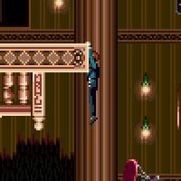
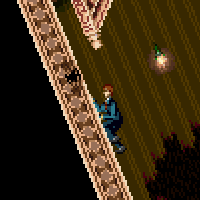
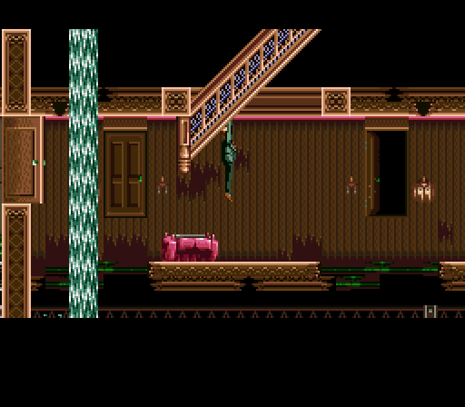
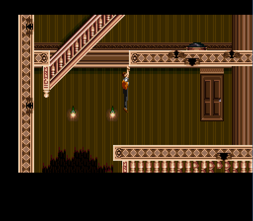
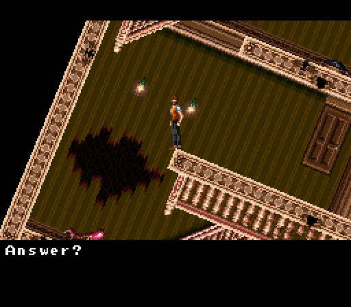
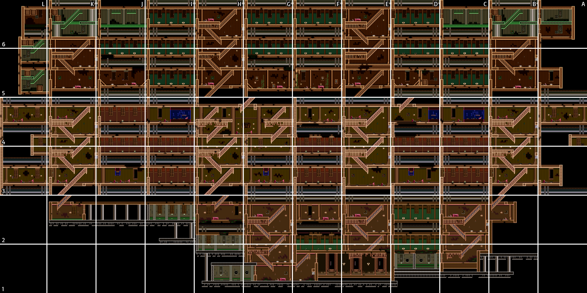

- [Synopsis](#synopsis)
- [Game Overview](#game-overview)
	- [Basic Controls](#basic-controls)
		- [Calling and Leading Survivors](#calling-and-leading-survivors)
		- [Grabbing Survivors](#grabbing-survivors)
		- [Skipping Protagonist Intro Stories](#skipping-protagonist-intro-stories)
	- [Platforming Advice](#platforming-advice)
		- [Jump Types](#jump-types)
		- [Reaching Higher Levels](#reaching-higher-levels)
		- [Strategies for Challenging Rooms](#strategies-for-challenging-rooms)
			- [Above Francoise Maxwell's Room](#above-francoise-maxwells-room)
			- [The Top of Miller Strisers' Room](#the-top-of-miller-strisers-room)
	- [Game Map](#game-map)
- [Achievements](#achievements)
	- [Survivors](#survivors)
	- [Endings](#endings)
	- [Events and Other Achievements](#events-and-other-achievements)

# Synopsis
|||
|:--|:--|
|**Game Page**|https://retroachievements.org/game/1144|
|**Set Difficulty**|6/10|
|**Approximate time to master**|10 hours|
|**Minimum numbers of playthroughs needed**|5|
|**Number of missable achievements**|none|
|**Does difficulty affect achievements?**|N/A|
|**Hardest achievement of the set**||
|**Set Developers**|[TheMysticalOne](https://retroachievements.org/user/TheMysticalOne)|
|**Guide Author**|[Ajogamer](https://retroachievements.org/user/Ajogamer), [authorblues](https://retroachievements.org/user/authorblues)|

# Game Overview

> September 13, 1921, 11 min past 7 in the evening– luxury liner Lady Crithania, sailing off the coast of Humbleton, is wrecked in stormy weather. It sank within 6 hours, after capsizing due to enormous waves. 2,300 people including crew are all reported missing. It was the worst disaster in seafaring history.

The goal of SOS is to find a way to escape the ship within the game's time limit of one real world hour. If your character gets knocked out in any way (such as falling a great distance or getting hit by a falling object), you will lose five minutes from the clock.

Escape can be challenging since the Lady Crithania is not only a giant, labyrinthian cruise ship, but it is also tricky to traverse due to the ship being turned upside-down due to the initial capsize and its angle frequently rotating as it gets closer to sinking. In addition, traversal can get even trickier as time ticks closer to the one hour deadline, since the ship's rotations will gradually get more intense, along with parts of the ship eventually beginning to fill with water.

Of course, if you want a good ending, you don't just want to escape on your own; you also want to gather as many survivors as you can (more information on those ending requirements in the "Suggested Routes for Best Ending" section). This is something else that adds to the game's difficulty and complexity. Finding and rescuing survivors takes precious time (especially since many will take a bit of convincing first), and survivors also require heavy guidance if you wish to keep them alive, since their movement is mainly determined by how you direct them, and they permanently die if they fall a great distance.

When starting out, this game can easily feel overwhelming and at times frustrating (especially when encountering situations where the game's survivor AI refuses to cooperate or seems to have a death wish), but if you can get past this game's high learning curve, SOS is a very interesting experience that isn't quite like any other game on the SNES (or any other game system, for that matter), and you might even find it fun! For that reason, this guide was created to cover not only the game's achievements, but to also give more info on managing many of the game's mechanics and other points of difficulty. Hopefully this guide will not only help you complete the set, but also make it easier to enjoy the process!

## Basic Controls

|Button|Action|
|:--:|:--|
|B|Jump|
|X|Talk -- in response to "Communicate?" and "Answer?" prompts|
|Y|Interact -- open doors, grab survivors' hands, interact during conversation|
|L/R|Call or direct your followed survivors|
|Start|Pause|
|Select|View Map (if character has a map)|

When viewing the map, the following controls apply:
|Button|Action|
|:--:|:--|
|B|Zoom In Map|
|A|Zoom Out Map|
|L/R|Rotate Map|

### Calling and Leading Survivors

Press L or R (shoulder buttons) to call your survivors to the location you are standing at, with the position you called them to being indicated by a yellow arrow. This arrow will not follow your position, but rather acts a gathering point. While moving survivors with this method can be tedious over longer distances, it also tends to be the most reliable and precise way to lead them, so it is often best for getting them past tricker platforms and more dangerous locations.

> [!TIP]
> You can call survivors from a neighboring room as well, though expect to wait longer if they were farther away from the entrance.

> [!WARNING]
> Don't leave your friends behind! Survivors will leave your party if you are two or more rooms away from where they are.

If you want survivors to follow behind you automatically as you walk, get all your survivors to stand still at a single spot. When the survivors reach the gathering point, the arrow will turn red. Stand on the red arrow, then hold down the L or R button, and the survivors will follow you as you walk (as best as their AI can manage) until you let go of the L/R button.

Moving survivors with this method is more simple and convenient, so it often works well for moving them over longer distances, especially if it is a safer area with less dangerous or awkward jumps. That said, it is still important to keep an eye on your survivors even when using this method, since it is possible for them to get stuck on obstacles, fall behind, or die if they miss a jump. 

> [!TIP]
> Keep in mind that survivors will only follow you into the next room if the first survivor in your party is near you when you transition.

### Grabbing Survivors

When your followed survivors are jumping towards your location, if you are concerned that they may not safely land the jump, it is possible to grab their hand and pull them up to you by pressing Y. This is especially useful as a way to help your survivors make trickier or more dangerous jumps, or to help get them unstuck when the survivor AI gets stuck in a loop. Also, note that holding down the Y button won't work; you need to press it at the right time.

> [!TIP]
> For best results, don't try to time the Y button -- just mash Y. There's no need to mash rapidly. Just tap the button.

### Skipping Protagonist Intro Stories

While the game's intros give interesting and relevant backstory, including useful context that can be helpful to figure out how to get the best ending, they can quickly get repetitive in the process of replaying the game for better endings. To skip this cutscene, simultaneously push start+select as the intro is playing out and the game will skip straight to the point where you have free control of your character pre-capsize.

## Platforming Advice

While SOS has some fairly precise platforming, you're actually pretty well-equipped to traverse most of it due to the large amount of control you have over your jumps.

### Jump Types

The **neutral jump** is a jump that goes straight upwards, and is performed by pushing the B button without pressing left/right on the d-pad. This jump provides more height, making it useful for reaching higher places. You can still control your character in midair with left and right after neutral jumping, but your horizontal movement is slow.

The **long jump** is performed by jumping with the B button while pressing left or right, usually done while walking. It is useful whenever you need more distance, such as when jumping over gaps. You still have air control in midair when long jumping; by pressing the opposite direction of your jump, you can slow your momentum to land on a closer platform, and pressing with the direction of your jump, you can extend the distance covered.

### Reaching Higher Levels

You don’t always need to land squarely on a platform, since your protagonist will grab onto platform edges and hang spots (such as staircase railings) and can then pull themselves up onto the platform.

Angled walls and platforms are also climbable.

Your led survivors can also grab onto ledge edges and climb angled platforms. They’re not always as consistent at it as the player is though, so they’ll sometimes need your help through carefully directing them or grabbing their hands to pull them up.

### Strategies for Challenging Rooms

#### Above Francoise Maxwell's Room

Right by the room where Francoise Maxwell is found (room 28, coordinates ?? on the map) is an upward jump to reach a higher part of the ship. This is an essential jump on many routes. To learn more about how to make this jump consistently, click to expand the section below.

<em>[Click to expand]</em>

At first, it may seem like it can only be made while the ship is at an angle. However, it's actually possible to make this jump even when the ship is completely level; the grab spot just happens to be extremely precise. This below image shows the grab spot.

However, if you try simply jumping at that spot, you'll likely find that your character won't grab it, due to how ridiculously precise it is. However, there are two ways to make this jump a bit more consistent. The first is to use the couch just below the jump as a marker. Just have your character stand over what’s roughly the center of the couch, then neutral jump while holding right, and you might grab onto the ledge.

[[ SOS - Francoise Maxwell Horizontal Stairway Jump 2.webm ]]

Alternatively, you might be able to grab the spot by simply moving left or right a bit while neutral jumping in that general area. The video below demonstrates this less precise method by grabbing onto then intentionally dropping down from the ledge a few times, to give a better idea of how to use this alternate method.

[[ SOS - Francoise Maxwell Horizontal Stairway Jump 3.webm ]]

#### The Top of Miller Strisers' Room 

Inside the room where Miller Strisers is found (room 17, coordinates ?? on the map), there's a jump that may seem impossible at first glance, but it's actually pretty easy when you know how to handle it. To learn more about how to make this jump consistently, click to expand the section below.

<em>[Click to expand]</em>

As shown in the following screenshot, when the ship is completely level, even at the max height of our jump we're just barely short of reaching the ledge.

This means that in order to make this jump, you need to wait for the ship's angle to change first. However, due to this being a room with a survivor in it, there's one caveat: you'll need to wait outside in order for the ship to rotate, because the game generally tries to maintain the ship's current angle while most survivor cutscenes are playing out (and on many routes, you may not want or be able to save Miller Strisers). Step outside of the room and wait for the angle to change, then return. Either a left or right angle will work.

**When the ship is angled left**, the jump is pretty simple. Just jump onto the wall to the left, then you can climb or jump up to the ledge from there, as shown here in the video below.

[[ SOS - Miller Strisers Jump Left Angle 1.webm ]]

**When the ship is angled right**, the jump is a bit more precise. Walk onto the upper tip on the edge of the platform near the top and jump towards the ledge from there.

[[ SOS - Miller Strisers Jump Right Angle 2.webm ]]

If you have trouble doing the jump from a standing position, you can also quickly walk left over the upper tip of the edge, then immediately take a step back to the right and make the jump, as shown below.

[[ SOS - Miller Strisers Jump Right Angle 3.webm ]]

## Game Map

|Name|Joins|Location|Pts|
|:--|:--|:--|:-:|
|Luke Heinz|any 🕞||5|
|Jeffrey Howell|L||5|
|Ismay Carl Townsend|L||2|
|Amy Markarson|C||4|
|Stella Adams|R||4|
|Harry Adams|R||4|
|Adela Howell|any||4|
|Kelly Nelson|J||3|
|John Rattler|C|||2|
|Jimmy Akers|any||2|
|Kleiver Mathews|any 🕞||???|
|Barbara Sinclair|any 🕞||???|
|Cooper Smith|any||2|
|Pamela Smith|any||4|
|Stacy Smith|any||4|
|Mary Maxwell|any||8|
|Francoise Maxwell|any||4|
|Alan Gebres|any||3|
|Richard Cunningham|any||3|
|Miller Strisers|R J||3|
|Tender Johnston|R J||3|
|Katherine Meibrus|any||6|
|Michael Burnings|any||3|
|Anna Tomaro|any||6|
|Frank Morton Coney|any||3|
|Henry Abrahams|R J||2|
|Jack Hamilton|any 🕞||5|
|Katherine Clayton|any||6|
|Angelica Snow|any||4|

# Achievements

## Survivors

Survivor achievements include the following information

- where to find them on the map
- who can rescue them (note that some survivors can only be rescued after the event at 33:00)
- the number of points they contribute toward the best ending calculation
- their stamina values, which determines how long they can be active before complaining about needing to rest

Some passengers require doing certain tasks or speaking in certain ways to recruit them, and this information is included as well.

<big><pre>
[Captain ! (10)](https://retroachievements.org/achievement/271816)
_Rescue Ismay Carl Townsend_
</pre></big>

|||
|:--|:--|
|Name|Ismay Carl Townsend|
|Where to find them|[A1](#game-map)|
|Who can rescue them|Luke only|
|Survivor points|2 🔑|
|Stamina|mid-high (144)|

Ismay is the key survivor for Luke. Read more about key survivors in the Best Endings section.

    

<big><pre>
[Amy Markarson (10)](https://retroachievements.org/achievement/271817)
_Rescue Amy Markarson_
</pre></big>

|||
|:--|:--|
|Name|Amy Markarson|
|Where to find them|[A1](#game-map)|
|Who can rescue them|Capris only|
|Survivor points|4 🔑|
|Stamina|mid-low (101)|

Amy is the key survivor for Capris. Read more about key survivors in the Best Endings section.

    

<big><pre>
[Harry Adams (10)](https://retroachievements.org/achievement/271818)
_Rescue Harry Adams_
</pre></big>

|||
|:--|:--|
|Name|Harry Adams|
|Where to find them|[A1](#game-map)|
|Who can rescue them|Redwin only|
|Survivor points|4 🔑|
|Stamina|mid (112)|

Harry is one of three key survivors for Redwin. Read more about key survivors in the Best Endings section.

    

<big><pre>
[Stella Adams (10)](https://retroachievements.org/achievement/271819)
_Rescue Stella Adams_
</pre></big>

|||
|:--|:--|
|Name|Stella Adams|
|Where to find them|[A1](#game-map)|
|Who can rescue them|Redwin only|
|Survivor points|4 🔑|
|Stamina|mid-low (104)|

Stella is one of three key survivors for Redwin. Read more about key survivors in the Best Endings section.

    

<big><pre>
[Jack Hamilton (10)](https://retroachievements.org/achievement/271820)
_Rescue Jack Hamilton_
</pre></big>

|||
|:--|:--|
|Name|Jack Hamilton|
|Where to find them|[A1](#game-map)|
|Who can rescue them|Anyone (after 33:00)|
|Survivor points|5 🔑|
|Stamina|mid (128)|

Jack is one of three key survivors for Redwin. Read more about key survivors in the Best Endings section.

    

<big><pre>
[Adela Howell (10)](https://retroachievements.org/achievement/271821)
_Rescue Adela Howell_
</pre></big>

|||
|:--|:--|
|Name|Adela Howell|
|Where to find them|[A1](#game-map)|
|Who can rescue them|Anyone|
|Survivor points|4 🔑|
|Stamina|mid (117)|

Adela is the key survivor for Jeffrey. Read more about key survivors in the Best Endings section.

    

<big><pre>
[Jeffrey Howell (10)](https://retroachievements.org/achievement/271822)
_Rescue Jeffrey Howell_
</pre></big>

|||
|:--|:--|
|Name|Jeffrey Howell|
|Where to find them|[A1](#game-map)|
|Who can rescue them|Luke only|
|Survivor points|5|
|Stamina|mid (128)|

    

<big><pre>
[Luke Heinz (10)](https://retroachievements.org/achievement/271823)
_Rescue Luke Heinz_
</pre></big>

|||
|:--|:--|
|Name|Luke Heinz|
|Where to find them|[A1](#game-map)|
|Who can rescue them|Anyone after 33:00|
|Survivor points|5|
|Stamina|very high (176)|

    

<big><pre>
[Dieting ? (10)](https://retroachievements.org/achievement/271824)
_Rescue John Rattler_
</pre></big>

|||
|:--|:--|
|Name|John Rattler|
|Where to find them|[A1](#game-map)|
|Who can rescue them|Capris only|
|Survivor points|2|
|Stamina|mid-high (149)|

    

<big><pre>
[Kelly Nelson (10)](https://retroachievements.org/achievement/271825)
_Rescue Kelly Nelson_
</pre></big>

|||
|:--|:--|
|Name|Kelly Nelson|
|Where to find them|[A1](#game-map)|
|Who can rescue them|Jeffrey only|
|Survivor points|3|
|Stamina|high (160)|

    

<big><pre>
[Cooper Smith (10)](https://retroachievements.org/achievement/271826)
_Rescue Cooper Smith_
</pre></big>

|||
|:--|:--|
|Name|Cooper Smith|
|Where to find them|[A1](#game-map)|
|Who can rescue them|Anyone|
|Survivor points|2|
|Stamina|mid-high (149)|

    

<big><pre>
[Pamela Smith (10)](https://retroachievements.org/achievement/271827)
_Rescue Pamela Smith_
</pre></big>

|||
|:--|:--|
|Name|Pamela Smith|
|Where to find them|[A1](#game-map)|
|Who can rescue them|Anyone|
|Survivor points|4|
|Stamina|low (85)|

    

<big><pre>
[Stacy Smith (10)](https://retroachievements.org/achievement/271828)
_Rescue Stacy Smith_
</pre></big>

|||
|:--|:--|
|Name|Stacy Smith|
|Where to find them|[A1](#game-map)|
|Who can rescue them|Anyone|
|Survivor points|4|
|Stamina|mid (128)|

    

<big><pre>
[Jimmy Akers (10)](https://retroachievements.org/achievement/271829)
_Rescue Jimmy Akers_
</pre></big>

|||
|:--|:--|
|Name|Jimmy Akers|
|Where to find them|[A1](#game-map)|
|Who can rescue them|Anyone|
|Survivor points|2|
|Stamina|high (165)|

    

<big><pre>
[Miller Strisers (10)](https://retroachievements.org/achievement/271830)
_Rescue Miller Strisers_
</pre></big>

|||
|:--|:--|
|Name|Miller Strisers|
|Where to find them|[A1](#game-map)|
|Who can rescue them|Redwin or Jeffrey only|
|Survivor points|3|
|Stamina|high (160)|

    

<big><pre>
[Tender Johnston (10)](https://retroachievements.org/achievement/271831)
_Rescue Tender Johnston_
</pre></big>

|||
|:--|:--|
|Name|Tender Johnston|
|Where to find them|[A1](#game-map)|
|Who can rescue them|Redwin or Jeffrey only|
|Survivor points|3|
|Stamina|high (160)|

    

<big><pre>
[Grefiure, come back to me. (10)](https://retroachievements.org/achievement/271832)
_Rescue Michael Burnings_
</pre></big>

|||
|:--|:--|
|Name|Michael Burnings|
|Where to find them|[A1](#game-map)|
|Who can rescue them|Anyone|
|Survivor points|3|
|Stamina|high (160)|

After speaking with Michael, he will ask you to retrieve his violin, which is in the top left of the room he is in, before he will join your group. Jump to it and press Y to grab it.
    

<big><pre>
[Barbara Sinclair (10)](https://retroachievements.org/achievement/271833)
_Rescue Barbara Sinclair_
</pre></big>

|||
|:--|:--|
|Name|Barbara Sinclair|
|Where to find them|[A1](#game-map)|
|Who can rescue them|Anyone after 33:00|
|Survivor points|???|
|Stamina|mid (117)|

    

<big><pre>
[Kleiver Mathews (10)](https://retroachievements.org/achievement/271834)
_Rescue Kleiver Mathews_
</pre></big>

|||
|:--|:--|
|Name|Kleiver Mathews|
|Where to find them|[A1](#game-map)|
|Who can rescue them|Anyone after 33:00|
|Survivor points|???|
|Stamina|high (165)|

    

<big><pre>
[Alan Gebres (10)](https://retroachievements.org/achievement/271835)
_Rescue Alan Gebres_
</pre></big>

|||
|:--|:--|
|Name|Alan Gebres|
|Where to find them|[A1](#game-map)|
|Who can rescue them|Anyone|
|Survivor points|3|
|Stamina|low (88)|

Will only join Luke if you don't answer after Alan says "Please save the passengers first", then resume talking after Alan responds.

<big><pre>
[Richard Cunningham (10)](https://retroachievements.org/achievement/271836)
_Rescue Richard Cunningham_
</pre></big>

|||
|:--|:--|
|Name|Richard Cunningham|
|Where to find them|[A1](#game-map)|
|Who can rescue them|Anyone|
|Survivor points|3|
|Stamina|high (165)|

    

<big><pre>
[Anna Tamaro (10)](https://retroachievements.org/achievement/271837)
_Rescue Anna Tamaro_
</pre></big>

|||
|:--|:--|
|Name|Anna Tamaro|
|Where to find them|[A1](#game-map)|
|Who can rescue them|Anyone|
|Survivor points|6|
|Stamina|mid (133)|

    

<big><pre>
[Frank Coney (10)](https://retroachievements.org/achievement/271838)
_Rescue Frank Coney_
</pre></big>

|||
|:--|:--|
|Name|Frank Morton Coney|
|Where to find them|[A1](#game-map)|
|Who can rescue them|Anyone|
|Survivor points|3|
|Stamina|mid-low (96)|

    

<big><pre>
[Angelica Snow (10)](https://retroachievements.org/achievement/271839)
_Rescue Angelica Snow_
</pre></big>

|||
|:--|:--|
|Name|Angelica Snow|
|Where to find them|[A1](#game-map)|
|Who can rescue them|Anyone|
|Survivor points|4|
|Stamina|mid (117)|

On some routes, recruiting her might involve using Y to interact during the conversation.

    

<big><pre>
[Katherine Clayton (10)](https://retroachievements.org/achievement/271840)
_Rescue Katherine Clayton_
</pre></big>

|||
|:--|:--|
|Name|Katherine Clayton|
|Where to find them|[A1](#game-map)|
|Who can rescue them|Anyone|
|Survivor points|6|
|Stamina|mid (128)|

Katherine will only join your group if Angelica has already joined.

    

<big><pre>
[Katherine Meibrus (10)](https://retroachievements.org/achievement/271841)
_Rescue Katherine Meibrus_
</pre></big>

|||
|:--|:--|
|Name|Katherine Meibrus|
|Where to find them|[A1](#game-map)|
|Who can rescue them|Anyone|
|Survivor points|6|
|Stamina|mid (117)|

If you are playing as Luke, Katherine will only join your group if you bring Michael Burnings

    

<big><pre>
[Francoise Maxwell (10)](https://retroachievements.org/achievement/271842)
_Rescue Francoise Maxwell_
</pre></big>

|||
|:--|:--|
|Name|Francoise Maxwell|
|Where to find them|[A1](#game-map)|
|Who can rescue them|Anyone|
|Survivor points|4|
|Stamina|mid (120)|

After initiating communication in the medical room, press Y to wake her up.

    

<big><pre>
[Mary Maxwell (10)](https://retroachievements.org/achievement/271843)
_Rescue Mary Maxwell_
</pre></big>

|||
|:--|:--|
|Name|Mary Maxwell|
|Where to find them|[A1](#game-map)|
|Who can rescue them|Anyone|
|Survivor points|8|
|Stamina|very low (68)|

Will only join if her mother, Franoise, is in your party.

    

<big><pre>
[Henry Abrahams (10)](https://retroachievements.org/achievement/271844)
_Rescue Henry Abrahams_
</pre></big>

|||
|:--|:--|
|Name|Henry Abrahams|
|Where to find them|[A1](#game-map)|
|Who can rescue them|Redwin or Jeffrey only|
|Survivor points|2|
|Stamina|high (160)|

Appears with Chief Engineer Ussarr when you have between three and six survivors in your party. For more information on how to deal with Ussarr and potentially recruit Henry, look at the achievement ["Don't Believe His Lies"](#ach-ussarr)

## Endings

<big><pre>
[Sad End (1)](https://retroachievements.org/achievement/271846)
_Explore the ship long enough to suffer a tragic fate._
</pre></big>

    

<big><pre>
[The Night Sky Awaits (25)](https://retroachievements.org/achievement/271858)
_Escaped through the Boiler Room_
</pre></big>

    

<big><pre>
[Creeper Ending (25)](https://retroachievements.org/achievement/271856)
_Poor Luke..._
</pre></big>

    

<big><pre>
[Capris Best Ending (50)](https://retroachievements.org/achievement/271851)
_Get the best ending as Capris_
</pre></big>

    

<big><pre>
[Redwin Best Ending (50)](https://retroachievements.org/achievement/271852)
_Get the best ending as Redwin_
</pre></big>

    

<big><pre>
[Luke Best Ending (25)](https://retroachievements.org/achievement/271853)
_Get the best ending as Luke_
</pre></big>

    

<big><pre>
[Jeffrey Best Ending (25)](https://retroachievements.org/achievement/271854)
_Get the best ending as Jeffrey_
</pre></big>

    

<big><pre>
[HURRY !!! (25)](https://retroachievements.org/achievement/271847)
_Escape the ship before the end of the 4th minute!_
</pre></big>

## Events and Other Achievements
    

<big><pre>
[A Nightmare Starts (1)](https://retroachievements.org/achievement/271845)
_This shaking... Oh, no !_
</pre></big>

This achievement is earned automatically after a small amount of time passes. The Lady Crithania capsizes and the boat flips upside down, beginning the one hour in-game clock for you to escape with or without rescuing other passengers.

    

<big><pre>
[Don't Believe His Lies (10)](https://retroachievements.org/achievement/271848)
_Give me my survivors back !!!_
</pre></big>

Chief Engineer Ussarr will block your path to the boiler room if you have between three and six survivors in your party. You will still be at liberty to leave, but he will take control of your group of passengers if you don't navigate this conversation correctly. The conversation goes differently for each of the four protagonists:

- As **Capris**,
- As **Luke**,
- As **Jeffrey**,
- As **Redwin**,

Once you've earned this achievement, you can avoid this interaction when doing attempts at getting the best endings by making sure you have 7 survivors in your party, the maximum party size.
    

<big><pre>
[Useless Map (5)](https://retroachievements.org/achievement/271849)
_Find the map of the ship (not with Luke)_
</pre></big>

    

<big><pre>
[Sink Or Swim ! (25)](https://retroachievements.org/achievement/271850)
_Reach the boiler room in the nick of time (after the second and final capsize cutscene)_
</pre></big>

    

<big><pre>
[Take My Hand (5)](https://retroachievements.org/achievement/271855)
_Grab my hand !_
</pre></big>

    

<big><pre>
[Paganini's Power! (10)](https://retroachievements.org/achievement/271857)
_Listen to Michael play his violin to help a widow continue on._
</pre></big>

    
